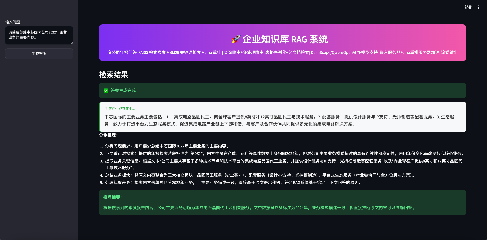

# 企业知识库 RAG 系统

<p align="center">
  <a href="https://github.com/dongliang-tech/EnterpriseRAG"></a>
  <a href="https://www.python.org/downloads/"></a>
  <a href="https://github.com/dongliang-tech/EnterpriseRAG"></a>
  <a href="https://github.com/dongliang-tech/EnterpriseRAG"></a>
  <a href="https://github.com/dongliang-tech/EnterpriseRAG"></a>
</p>

<p align="center">
  <em>基于 RAG（检索增强生成）技术的企业级知识库问答系统，支持年报分析、多模型推理、混合检索与流式输出。</em>
</p>

<p align="center">
  🇨🇳 中文 | 🌐 English
</p>

---

## 📸 产品预览

<div align="center">
  
  <p><em>EnterpriseRAG Web 界面 — 多公司年报问答系统</em></p>
</div>

---

## ⭐ 为什么选择 EnterpriseRAG？

- 🚀 **开箱即用**：5 分钟完成部署，Streamlit 一键启动
- 🧠 **智能检索**：向量检索 + BM25 + LLM 重排 + Jina 重排，多种检索策略自由组合
- 🔍 **精准问答**：支持字符串、数值、布尔、名单、比较类问题，多公司对比自动拆解
- 📊 **表格优先**：表格序列化，将表格内容转化为独立信息块，提升数值问答准确率
- 🔄 **流式输出**：实时展示推理过程，答案生成看得见
- 💾 **缓存加速**：Embedding 缓存 + Jina 重排缓存，相同查询秒级响应
- 🎯 **企业级**：支持本地部署，数据不出域，私有化部署
- 🌈 **多模型支持**：OpenAI、DashScope/Qwen、Gemini、IBM Watson 等
- 🎨 **精美界面**：Streamlit 构建，明暗主题切换，交互流畅

---

## 🎯 快速开始

### 1. 环境准备

```bash
# 创建虚拟环境
python -m venv venv
source venv/bin/activate  # macOS/Linux
# venv\Scripts\activate   # Windows

# 安装依赖
pip install -r requirements.txt
```

### 2. 配置环境变量

```bash
# 复制环境变量模板
cp .env.example .env

# 编辑 .env 文件，填入你的 API 密钥
# 至少需要配置 OPENAI_API_KEY 或 DASHSCOPE_API_KEY
```

### 3. 下载模型

```bash
# 下载 Docling 解析模型（本地 PDF 解析）
python main.py download-models
```

### 4. 启动应用

```bash
# Streamlit Web UI（推荐）
streamlit run app_streamlit.py

# 或使用启动脚本
bash run.sh
```

浏览器打开 `http://localhost:8501`，开始使用！

> **更多详细文档**请参考下方 [运行方式](#7-运行方式) 章节。

---

## 📖 项目概述

### 1.1 项目简介

本项目是一个基于 RAG（Retrieval-Augmented Generation，检索增强生成）技术的企业知识库问答系统。系统能够对企业年报 PDF 文档进行智能解析、向量化存储，并基于检索到的上下文精准回答用户问题。

### 1.2 核心特性

- **多格式 PDF 解析**：支持 Docling 本地解析和 PDF MinerU 云端 API 解析
- **混合检索策略**：向量检索 + BM25 关键词检索 + LLM 重排 + Jina 重排
- **查询路由**：根据问题类型自动选择最优检索策略
- **多向量路由**：支持多 Embedding 模型并行检索，选择最佳结果
- **父文档检索**：支持 chunk 级检索和 page 级父文档返回
- **多模型支持**：OpenAI、Gemini、IBM Watson、阿里云 DashScope/Qwen
- **多问题类型**：支持字符串、数值、布尔、名单、比较类问题
- **表格智能处理**：表格序列化，将表格转换为独立信息块
- **可视化界面**：基于 Streamlit 的 Web 交互界面，支持明暗主题切换
- **并行处理**：支持多进程 PDF 解析和多线程问题处理
- **缓存加速**：Embedding 缓存（基于查询 MD5 hash）+ Jina Rerank 缓存（基于查询+文档组合 hash），相同查询秒级响应

### 1.3 技术栈

| 类别 | 技术/框架 |
|------|-----------|
| 编程语言 | Python 3.11 |
| PDF 解析 | Docling、PDF MinerU |
| 向量数据库 | FAISS |
| 关键词检索 | BM25 (rank-bm25) |
| 重排服务 | Jina AI Reranker |
| LLM 接入 | OpenAI API、阿里云 DashScope、Gemini API |
| 文本分块 | LangChain RecursiveCharacterTextSplitter |
| Web 框架 | Streamlit |
| CLI 框架 | Click |
| 数据验证 | Pydantic |

---

## 🏗️ 项目架构

### 2.1 整体架构图

```
┌─────────────────────────────────────────────────────────────┐
│                        用户交互层                              │
│  ┌─────────────────┐  ┌──────────────────────────────────┐  │
│  │  Streamlit UI   │  │         CLI 命令行                │  │
│  │ (app_streamlit) │  │           (main.py)              │  │
│  └────────┬────────┘  └──────────────┬───────────────────┘  │
└───────────┼──────────────────────────┼──────────────────────┘
            │                          │
┌───────────▼──────────────────────────▼──────────────────────┐
│                       业务编排层 (Pipeline)                    │
│  ┌──────────────────────────────────────────────────────┐   │
│  │                    Pipeline 类                        │   │
│  │  (流程控制 / 配置管理 / 阶段调度)                     │   │
│  └────────┬──────────┬──────────┬──────────┬───────────┘   │
└───────────┼──────────┼──────────┼──────────┼───────────────┘
            │          │          │          │
┌───────────▼──┐ ┌─────▼────┐ ┌──▼──────┐ ┌▼──────────────┐
│  文档处理层   │ │ 检索层   │ │ 重排层  │ │  答案生成层    │
│ (Ingestion)  │ │(Retrieval)│ │(Rerank)│ │ (Q.Processing) │
└──────┬───────┘ └─────┬─────┘ └────┬────┘ └───────┬───────┘
       │               │            │               │
┌──────▼───────┐ ┌─────▼─────┐ ┌────▼────┐ ┌──────▼───────┐
│  PDF 解析    │ │ 向量检索  │ │ LLM重排 │ │  LLM API     │
│  文本分块    │ │ BM25检索  │ │ Jina重排│ │  提示词工程  │
│  表格序列化  │ │ 混合检索  │ │         │ │  比较推理    │
└──────────────┘ └───────────┘ └─────────┘ └──────────────┘
```

### 2.2 核心数据流

```
PDF 文档
   │
   ▼
PDF 解析 (Docling / MinerU)
   │
   ▼
报告规整 + 表格序列化
   │
   ▼
文本分块 (Text Splitter)
   │
   ▼
向量数据库 (FAISS) + BM25 索引
   │
   ▼
用户问题
   │
   ▼
公司名提取 → 检索 (向量/BM25/混合) → 重排 (LLM)
   │
   ▼
RAG 上下文构建
   │
   ▼
LLM 答案生成 (结构化输出)
   │
   ▼
答案 + 引用来源
```

---

## 📂 目录结构

```
EnterpriseRAG/
├── data/
│   └── stock_data/                     # 股票数据示例
│       ├── pdf_reports/                # PDF 年报文件
│       ├── databases/
│       │   ├── chunked_reports/        # 分块后的报告 (JSON)
│       │   └── vector_dbs/             # FAISS 向量数据库
│       ├── debug_data/
│       │   └── 03_reports_markdown/    # 转换后的 Markdown
│       ├── questions.json              # 问题列表
│       ├── subset.csv                  # 公司元数据
│       └── answers_*.json              # 生成的答案
├── docs/
│   └── src_modules_overview.md         # 模块概览文档
├── screenshots/                        # 项目截图
│   └── demo.png                        # 产品界面预览
├── src/                                # 核心源代码
│   ├── pipeline.py                     # 主流程编排
│   ├── pdf_parsing.py                  # PDF 解析 (Docling)
│   ├── pdf_mineru.py                   # PDF 解析 (MinerU API)
│   ├── parsed_reports_merging.py       # 报告文本规整
│   ├── text_splitter.py                # 文本分块
│   ├── ingestion.py                    # 向量库/BM25 构建
│   ├── retrieval.py                    # 检索模块
│   ├── reranking.py                    # 重排模块
│   ├── questions_processing.py         # 问题处理
│   ├── api_requests.py                 # LLM API 封装
│   ├── api_request_parallel_processor.py # 异步 API 处理
│   ├── prompts.py                      # 提示词模板
│   └── tables_serialization.py         # 表格序列化
├── app_streamlit.py                    # Streamlit Web UI
├── main.py                             # CLI 入口
├── run.sh                              # 启动脚本
├── requirements.txt                    # Python 依赖
├── .env.example                        # 环境变量模板
├── LICENSE                             # 开源许可证
├── CONTRIBUTING.md                     # 贡献指南
└── README.md                           # 项目说明
```

---

## 🧩 核心模块详解

### 4.1 主流程编排 - pipeline.py

**文件位置**：[src/pipeline.py](src/pipeline.py)

#### 核心类

##### `PipelineConfig`
路径配置类，管理所有数据目录和文件路径。

**主要属性**：
- `root_path` - 数据根目录
- `pdf_reports_dir` - PDF 报告目录
- `questions_file_path` - 问题文件路径
- `answers_file_path` - 答案输出路径
- `vector_db_dir` - 向量数据库目录
- `documents_dir` - 分块文档目录
- `reports_markdown_path` - Markdown 报告目录

##### `RunConfig`
运行配置类，定义管道各阶段的开关和参数。

**主要属性**：
| 属性 | 类型 | 默认值 | 说明 |
|------|------|--------|------|
| `use_serialized_tables` | bool | False | 是否使用序列化表格 |
| `parent_document_retrieval` | bool | False | 是否启用父文档检索 |
| `use_vector_dbs` | bool | True | 是否使用向量数据库 |
| `use_bm25_db` | bool | False | 是否使用 BM25 检索 |
| `llm_reranking` | bool | False | 是否启用 LLM 重排 |
| `llm_reranking_sample_size` | int | 30 | 重排采样数量 |
| `top_n_retrieval` | int | 10 | 检索返回 top N |
| `parallel_requests` | int | 1 | 并行请求数 |
| `api_provider` | str | "dashscope" | API 提供商 |
| `answering_model` | str | "qwen-turbo-latest" | 回答模型 |

##### `Pipeline`
主流程类，编排整个 RAG 管道的各个阶段。

**核心方法**：

| 方法 | 说明 |
|------|------|
| `parse_pdf_reports()` | 解析 PDF 报告（支持并行） |
| `export_reports_to_markdown()` | 使用 MinerU 将 PDF 转 Markdown |
| `chunk_reports()` | 对报告进行文本分块 |
| `create_vector_dbs()` | 创建 FAISS 向量数据库 |
| `create_bm25_db()` | 创建 BM25 索引 |
| `process_parsed_reports()` | 完整报告处理流程（分块+建库） |
| `process_questions()` | 批量处理问题并生成答案 |
| `answer_single_question()` | 单条问题即时推理 |
| `answer_single_question_streaming()` | 流式单条问题推理 |

**预设配置**：
- `base_config` - 基础配置（向量检索 + 路由）
- `pdr_config` - 父文档检索配置
- `max_config` - 最强配置（序列化表格 + 父文档检索 + LLM 重排）

---

### 4.2 PDF 解析模块

#### 4.2.1 pdf_parsing.py (Docling 本地解析)

**文件位置**：[src/pdf_parsing.py](src/pdf_parsing.py)

##### `PDFParser` 类
基于 Docling 库的 PDF 文档解析器。

**核心功能**：
- 调用 Docling 进行 PDF 结构解析
- 支持 OCR 文字识别
- 表格结构识别与提取
- 多进程并行解析

**核心方法**：
| 方法 | 说明 |
|------|------|
| `convert_documents()` | 批量转换 PDF 文档 |
| `process_documents()` | 处理转换结果并导出 JSON |
| `parse_and_export()` | 完整解析并导出流程 |
| `parse_and_export_parallel()` | 多进程并行解析 |

##### `JsonReportProcessor` 类
将 Docling 输出转换为标准化报告格式。

**核心功能**：
- JSON 报告组装
- 页面文本提取与合并
- 结构化数据提取

#### 4.2.2 pdf_mineru.py (MinerU 云端解析)

**文件位置**：[src/pdf_mineru.py](src/pdf_mineru.py)

**核心函数**：
| 函数 | 说明 |
|------|------|
| `get_task_id()` | 提交 MinerU 解析任务 |
| `get_result()` | 获取 MinerU 解析结果 |
| `unzip_file()` | 解压解析结果 |

**特点**：
- 基于 MinerU 云端 API
- 支持 OCR 和公式识别
- 返回结构化 Markdown 格式

---

### 4.3 检索与重排模块

#### retrieval.py

**文件位置**：[src/retrieval.py](src/retrieval.py)

| 类名 | 说明 |
|------|------|
| `BM25Retriever` | BM25 关键词检索 |
| `VectorRetriever` | FAISS 向量检索 |
| `HybridRetriever` | 混合检索（向量+关键词） |

#### reranking.py

**文件位置**：[src/reranking.py](src/reranking.py)

| 类名 | 说明 |
|------|------|
| `JinaReranker` | Jina 重排服务 |
| `LLMReranker` | LLM 重排服务 |

---

### 4.4 问题处理模块

#### questions_processing.py

**文件位置**：[src/questions_processing.py](src/questions_processing.py)

| 类名 | 说明 |
|------|------|
| `QuestionsProcessor` | 问题处理与答案生成 |

**核心方法**：
| 方法 | 说明 |
|------|------|
| `process_all_questions()` | 批量处理问题文件 |
| `process_single_question()` | 单条问题处理 |
| `process_comparative_question()` | 多公司比较问题处理 |
| `get_answer_for_company_streaming()` | 流式答案生成 |

---

## 📊 数据流与处理流程

### 5.1 数据格式说明

#### questions.json 格式
```json
[
  {
    "question": "中芯国际2024年的营收是多少？",
    "kind": "number"
  }
]
```

#### subset.csv 格式
| company_name | ticker | year | ... |
|--------------|--------|------|-----|
| 中芯国际 | SMCI | 2024 | ... |

#### answers_*.json 格式
```json
[
  {
    "question": "中芯国际2024年的营收是多少？",
    "final_answer": "中芯国际2024年的营收为XXX亿元",
    "reasoning_summary": "根据年报数据...",
    "relevant_pages": [3, 5, 12]
  }
]
```

### 5.2 处理流水线

```
阶段1: PDF 解析
  ├─ 输入: PDF 文件
  ├─ 方式: Docling 本地 / MinerU 云端
  └─ 输出: 结构化 JSON / Markdown

阶段2: 报告规整
  ├─ 输入: 结构化报告
  ├─ 处理: 文本合并 + 表格序列化
  └─ 输出: 规整后的 Markdown

阶段3: 文本分块
  ├─ 输入: Markdown 报告
  ├─ 处理: 递归文本分块 + Token 计数
  └─ 输出: 分块后的文档 (JSON)

阶段4: 建库索引
  ├─ 向量库: FAISS 向量数据库
  ├─ 关键词: BM25 索引
  └─ 输出: 检索可用数据库

阶段5: 问题处理
  ├─ 输入: 问题列表
  ├─ 处理: 检索 + 重排 + LLM 生成
  └─ 输出: 答案 JSON 文件
```

---

## ⚙️ 配置说明

### 6.1 环境变量配置

复制 `.env.example` 文件为 `.env` 并填入相应密钥：

```env
# OpenAI API 密钥（用于 GPT 模型和 OpenAI 兼容接口）
OPENAI_API_KEY=your_openai_api_key_here

# 阿里云 DashScope API 密钥（用于 Embedding 和 LLM）
DASHSCOPE_API_KEY=your_dashscope_api_key_here

# Gemini API 密钥（可选，用于 Google Gemini 模型）
GEMINI_API_KEY=your_gemini_api_key_here

# MinerU PDF 解析服务 API 密钥
MINERU_API_KEY=your_mineru_api_key_here

# Jina Reranker API 密钥（可选，用于文档重排）
JINA_API_KEY=your_jina_api_key_here
```

### 6.2 缓存配置

系统支持以下缓存机制以提升响应速度，避免重复调用外部 API：

| 缓存类型 | 缓存位置 | 缓存策略 | 用途说明 |
|----------|----------|----------|----------|
| Embedding 缓存 | `data/stock_data/databases/cache/embedding_cache.json` | 基于查询 MD5 hash | 将用户查询转换为向量时，相同查询直接返回缓存结果，无需重复调用 Embedding API，节省 API 费用并提升响应速度 |
| Jina Rerank 缓存 | `data/stock_data/databases/cache/jina_cache.json` | 基于查询+文档组合 hash | 对检索到的文档进行重排序时，相同查询+文档组合直接返回缓存的重排结果，避免重复调用 Jina Rerank API |

**缓存效果**：
- 首次查询：正常调用外部 API，响应时间约 3-5 秒
- 重复查询：直接命中缓存，响应时间降至毫秒级

缓存会在相同查询时自动命中，无需额外配置。

### 6.3 运行配置 (RunConfig)

#### 预设配置对比

| 配置项 | base | pdr | max |
|--------|------|-----|-----|
| 序列化表格 | ❌ | ❌ | ✅ |
| 父文档检索 | ❌ | ✅ | ✅ |
| LLM 重排 | ❌ | ❌ | ✅ |
| Jina 重排 | ❌ | ❌ | ✅ |
| 重排采样数 | - | - | 12 |
| 检索 Top N | 10 | 10 | 5 |
| 并行请求数 | 10 | 20 | 4 |
| 默认模型 | gpt-4o-mini | gpt-4o | qwen-turbo |

#### 自定义配置示例

```python
from src.pipeline import Pipeline, RunConfig

custom_config = RunConfig(
    use_serialized_tables=True,
    parent_document_retrieval=True,
    llm_reranking=True,
    llm_reranking_sample_size=20,
    top_n_retrieval=8,
    parallel_requests=2,
    api_provider="dashscope",
    answering_model="qwen-turbo-latest",
    config_suffix="_custom"
)

pipeline = Pipeline(root_path, run_config=custom_config)
```

---

## 🚀 运行方式

### 7.1 环境安装

```bash
# 1. 创建虚拟环境
python -m venv venv
source venv/bin/activate  # macOS/Linux
# venv\Scripts\activate   # Windows

# 2. 安装依赖
pip install -r requirements.txt

# 3. 配置环境变量
cp .env.example .env
# 编辑 .env 文件填入 API 密钥
```

### 7.2 CLI 命令行方式

**查看帮助**：
```bash
python main.py --help
```

**下载 Docling 模型**：
```bash
python main.py download-models
```

**解析 PDF**：
```bash
cd data/stock_data
python ../../main.py parse-pdfs --parallel --chunk-size 2 --max-workers 10
```

**序列化表格**：
```bash
python main.py serialize-tables --max-workers 5
```

**处理报告（分块+建库）**：
```bash
python main.py process-reports --config ser_tab
```

**处理问题**：
```bash
python main.py process-questions --config max
```

### 7.3 直接运行 pipeline.py

```bash
cd EnterpriseRAG
python src/pipeline.py
```

> 注意：需要先在 `pipeline.py` 底部取消对应方法的注释。

### 7.4 Streamlit Web UI

```bash
cd EnterpriseRAG
streamlit run app_streamlit.py
```

浏览器打开显示的地址（通常是 http://localhost:8501）。

### 7.5 Python API 调用

```python
from pathlib import Path
from src.pipeline import Pipeline, max_config

# 初始化
root_path = Path("data/stock_data")
pipeline = Pipeline(root_path, run_config=max_config)

# 单条问题提问
answer = pipeline.answer_single_question(
    "中芯国际2024年的营收是多少？",
    kind="number"
)
print(answer["final_answer"])

# 批量处理
pipeline.process_questions()
```

---

## 📦 依赖关系

### 8.1 模块依赖图

```
pipeline.py
    ├── pdf_parsing.py (PDFParser)
    ├── pdf_mineru.py (MinerU API)
    ├── parsed_reports_merging.py (PageTextPreparation)
    ├── text_splitter.py (TextSplitter)
    ├── ingestion.py (VectorDBIngestor, BM25Ingestor)
    ├── questions_processing.py (QuestionsProcessor)
    └── tables_serialization.py (TableSerializer)

questions_processing.py
    ├── retrieval.py (VectorRetriever, HybridRetriever)
    ├── api_requests.py (APIProcessor)
    └── prompts.py (提示词模板)

retrieval.py
    └── reranking.py (LLMReranker)

api_requests.py
    ├── prompts.py
    └── api_request_parallel_processor.py

tables_serialization.py
    └── api_requests.py (BaseOpenaiProcessor)
```

### 8.2 核心第三方依赖

| 库名 | 版本 | 用途 |
|------|------|------|
| docling | 2.14.0 | PDF 结构解析 |
| faiss-cpu | 1.9.0 | 向量相似度检索 |
| rank-bm25 | 0.2.2 | BM25 关键词检索 |
| langchain | 0.3.3 | 文本分块工具 |
| openai | 1.51.2 | OpenAI API 客户端 |
| dashscope | - | 阿里云 DashScope SDK |
| google-generativeai | 0.8.4 | Gemini API 客户端 |
| pydantic | 2.9.2 | 数据验证/结构化输出 |
| tiktoken | 0.8.0 | Token 计数 |
| streamlit | - | Web UI 框架 |
| click | 8.1.7 | CLI 框架 |
| pandas | 2.2.3 | 数据处理 |
| tenacity | - | 重试机制 |
| json_repair | 0.35.0 | JSON 修复 |

---

## 📚 关键类与函数索引

### 9.1 类索引

| 类名 | 所在文件 | 职责 |
|------|----------|------|
| `Pipeline` | [pipeline.py](src/pipeline.py#L68-L291) | 主流程编排 |
| `PipelineConfig` | [pipeline.py](src/pipeline.py#L22-L48) | 路径配置 |
| `RunConfig` | [pipeline.py](src/pipeline.py#L50-L67) | 运行配置 |
| `PDFParser` | [pdf_parsing.py](src/pdf_parsing.py#L32-L248) | PDF 解析 |
| `JsonReportProcessor` | [pdf_parsing.py](src/pdf_parsing.py#L250-L543) | 报告 JSON 组装 |
| `PageTextPreparation` | [parsed_reports_merging.py](src/parsed_reports_merging.py#L7-L435) | 报告文本规整 |
| `TextSplitter` | [text_splitter.py](src/text_splitter.py#L10-L203) | 文本分块 |
| `VectorDBIngestor` | [ingestion.py](src/ingestion.py#L56-L156) | 向量库构建 |
| `BM25Ingestor` | [ingestion.py](src/ingestion.py#L19-L54) | BM25 索引构建 |
| `VectorRetriever` | [retrieval.py](src/retrieval.py#L83-L283) | 向量检索 |
| `BM25Retriever` | [retrieval.py](src/retrieval.py#L19-L79) | BM25 检索 |
| `HybridRetriever` | [retrieval.py](src/retrieval.py#L286-L338) | 混合检索 |
| `LLMReranker` | [reranking.py](src/reranking.py#L38-L224) | LLM 重排 |
| `JinaReranker` | [reranking.py](src/reranking.py#L10-L35) | Jina 重排 |
| `QuestionsProcessor` | [questions_processing.py](src/questions_processing.py#L14-L572) | 问题处理 |
| `APIProcessor` | [api_requests.py](src/api_requests.py#L373-L518) | 统一 API 入口 |
| `BaseOpenaiProcessor` | [api_requests.py](src/api_requests.py#L20-L86) | OpenAI 处理器 |
| `BaseDashscopeProcessor` | [api_requests.py](src/api_requests.py#L673-L752) | DashScope 处理器 |
| `BaseIBMAPIProcessor` | [api_requests.py](src/api_requests.py#L89-L239) | IBM 处理器 |
| `BaseGeminiProcessor` | [api_requests.py](src/api_requests.py#L242-L371) | Gemini 处理器 |
| `AsyncOpenaiProcessor` | [api_requests.py](src/api_requests.py#L521-L671) | 异步 OpenAI 处理器 |
| `TableSerializer` | [tables_serialization.py](src/tables_serialization.py#L34-L303) | 表格序列化 |
| `TableSerialization` | [tables_serialization.py](src/tables_serialization.py#L306-L338) | 表格序列化提示词/Schema |

### 9.2 关键函数索引

| 函数名 | 所在文件/类 | 说明 |
|--------|-------------|------|
| `answer_single_question()` | [Pipeline](src/pipeline.py#L262-L291) | 单条问题即时推理 |
| `process_questions()` | [Pipeline](src/pipeline.py#L235-L260) | 批量处理问题 |
| `process_comparative_question()` | [QuestionsProcessor](src/questions_processing.py#L472-L537) | 多公司比较问题处理 |
| `get_answer_from_rag_context()` | [APIProcessor](src/api_requests.py#L413-L461) | RAG 答案生成 |
| `get_rephrased_questions()` | [APIProcessor](src/api_requests.py#L503-L518) | 比较问题拆解 |
| `get_task_id()` | [pdf_mineru.py](src/pdf_mineru.py#L13-L44) | 提交 MinerU 解析任务 |
| `get_result()` | [pdf_mineru.py](src/pdf_mineru.py#L46-L115) | 获取 MinerU 解析结果 |

---

## ❓ 常见问题

### Q1: 启动 Streamlit 时提示端口被占用？

```bash
# 查看占用 8501 端口的进程
lsof -i :8501

# 杀掉占用进程
kill <PID>

# 或使用不同端口
streamlit run app_streamlit.py --server.port 8502
```

### Q2: 解析 PDF 时找不到 Docling 模型？

```bash
# 手动下载模型
python main.py download-models
```

### Q3: API 调用超时或限流？

- 检查 API 密钥是否正确
- 降低并行请求数：修改 `RunConfig(parallel_requests=1)`
- 使用缓存功能加速重复查询

### Q4: 支持哪些大模型？

- **OpenAI**：GPT-4o, GPT-4o-mini, GPT-3.5-turbo 等
- **阿里云 DashScope**：Qwen (通义千问) 全系列
- **Google Gemini**：Gemini Pro, Gemini Ultra 等
- **IBM Watson**：IBM 自家大模型
- **其他 OpenAI 兼容接口**：任何支持 OpenAI API 格式的模型

### Q5: 如何添加自定义问题？

编辑 `data/stock_data/questions.json`：

```json
[
  {
    "question": "你的问题",
    "kind": "string"
  }
]
```

支持的 `kind` 类型：`string`、`number`、`boolean`、`names`

---

## 📄 许可证

本项目采用 [Apache License 2.0](LICENSE) 开源许可。

---

## 🤝 贡献指南

欢迎贡献代码、报告 Bug 或提出新功能建议！

查看 [CONTRIBUTING.md](CONTRIBUTING.md) 了解如何参与贡献。

---

## 🙏 致谢

感谢以下开源项目：
- [Docling](https://github.com/DS4SD/docling) - PDF 解析
- [FAISS](https://github.com/facebookresearch/faiss) - 向量检索
- [LangChain](https://github.com/langchain-ai/langchain) - 文本分块
- [Streamlit](https://github.com/streamlit/streamlit) - Web UI

---

<div align="center">

**如果这个项目对你有帮助，请给我们一个 ⭐ Star！**

[](https://github.com/dongliang-tech/EnterpriseRAG/stargazers)

</div>
